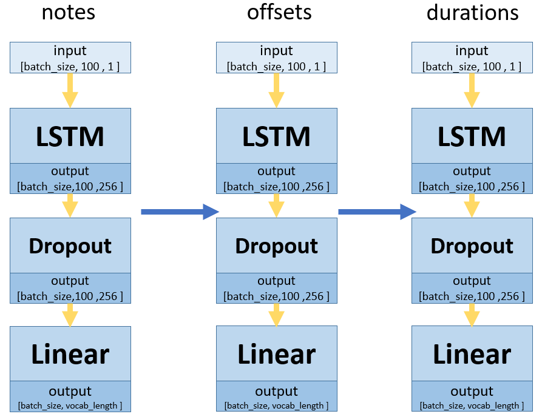

# music-generator

This project is trying to generate music with pytorch tools.

## Introduction

Beautiful music has the power to cultivate our emotions. However, finding pleasing compositions is a rarity that only few geniuses are able to do. Hence, with the advancement of AI technology today, we would like to utilize machine learning to adding captivating melodies to the world.

We refer to ['Keras-LSTM-Music-Generator'](https://github.com/jordan-bird/Keras-LSTM-Music-Generator) - which has already developed an impressive model using Keras and TensorFlow. However, as TensorFlow compatibility with modern GPUs has become limited, we aim to build a new model using PyTorch and strive to design an improved system that enhances the quality of music generation.

## Dataset

We use the same datasets as the project ['Keras-LSTM-Music-Generator'](https://github.com/jordan-bird/Keras-LSTM-Music-Generator), which consist of classical piano music.

## Preprocess

1. Use music21.converter.parse() to change each music in our datasets to 'music21.stream.Stream' objects.
2. Check whether the file has instrument parts or not. If so, use the 'partitionByInstrument' function to partition the stream by instrument and retrieves the notes. Otherwise, directly retrieves the notes using midi.flat.notes.
3. Use the 'isinstance' function to check the type of the element that we are going to parse
>If it is note object, then converting the pitch of the note to a string and append it to 'notes' list.  
If it is chord object, then converting the normal order of the chord's to a string and appended it to the 'notes' list.

4. Calculates the difference of the element's offset with offsetBase, convert it to string, and append it to the 'offsets' list.
5. Get the element's duration with 'element.duration.quarterLength', convert it to string and appent it to the 'duration' list.

## Model

Our model consists of three separate parts, each dedicated to training notes, offsets, and durations. Each part follows the same architecture, consisting of an LSTM layer, a dropout layer, and a linear layer. Below is our model dlagram.

## Pretrained Model

We provide a pretrained model in the 'checkpoints' folder, which is trained by using default parameter. You can directly use it to generate music or follow the instruction below to train your own one.

## How to Train and Generate Music

There are two ways to train the data:

First way:  
1. Move your directory to 'main' folder.
2. Start to train model with the command "python train.py" to evoke train.py.
> -e to set the number of epochs.(default is 50)  
-b to set the batch size.(default is 512)  
-st to decide how often to save the model.(default is 10, to save the model every 10 epochs)  
-p to decide whether to do the preprocess.(default is 1, do preprocess)  
   (The preprocess is to parsed the dataset in the folder 'dataset')   
If you choose to do the preprocess, you can use -d to set which folder of the data you want to parse in the folder 'dataset'(default is 'classical-piano-type0')

3. After training, you will get several models in 'checkpoint' folder.
4. Run generate.py with
> -m to choose which model you want to use for generating music.(default is 'pretrained_model.pt')  
-l to decide the length of music.(default is 300)  
-n to set the file name of your output file(default is 'output.mid')

5. Then you will get your midi file in 'output' folder.

Second way:  
1. Run 'script.py'
2. Following the instruction show on the screen:
> type 1 to Train a neural network  
>type 2 to Generate music with the model you train  
>type 3 to end the program

3. Continue follow the instructions displayed on the screen to complete the parameter setup, then the program will automatically start to work based on your commands.

## Conclusion

Using this model, we can generate a series of musical notes and produce music of a certain level of quality. However, there is still a long way to go before generating truly wonderful songs. As a result, we would continuously work on improving the model by adjusting parameter and try more complex model network in the future.